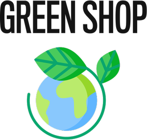

## Green Shop

### Logo

### Deploy

https://green-shop-indol.vercel.app/

### Descripción

Sitio Ecommerce de una tienda de productos saludables para el curso de react en Coderhouse.

### Construído

- React
- Firebase

### Dependencias

- Chakra
- Axios
- React Icons
- React Router DOM
- React Spinners
- React Toastify
- SweelAlert2

### Instalación

- Clonar el repositorio.
    - git clone https://github.com/ezeweiss/GreenSHOP
    - Moverse a la carpeta de proyecto.
        - cd green-shop
    - Instalamos las dependencias. 
        - npm install
    - Compilamos.
        - npm run dev

### Estructura del proyecto

### NavBar

- Logo
- Menú de categorías
- Ícono de carrito

### Body

- Listado de productos
- Detalle del producto

### Navegación

Enrutamiento entre las diferentes vistas.

### Checkout

Formulario para completar los datos del usuario

### Datos de contacto

LinkedIn https://www.linkedin.com/in/ezequiel-román-weiss-b95072242